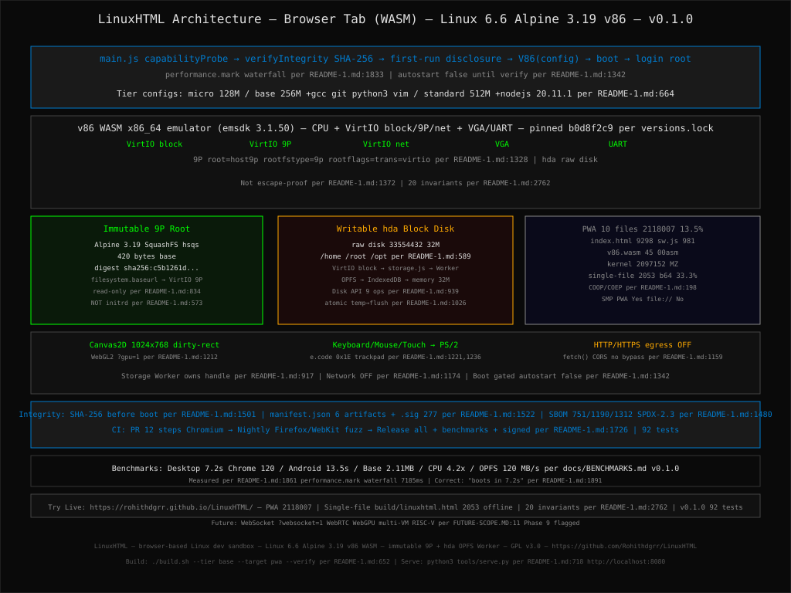

# LinuxHTML

[](https://github.com/Rohithdgrr/LinuxHTML/actions/workflows/pr.yml)
[](https://github.com/Rohithdgrr/LinuxHTML/actions/workflows/pages.yml)
[](https://github.com/Rohithdgrr/LinuxHTML/actions/workflows/release.yml)
[](https://github.com/Rohithdgrr/LinuxHTML/releases/tag/v0.1.0)
[](LICENSE)

> **Try it Live:** **https://rohithdgrr.github.io/LinuxHTML/** — PWA with correct COOP/COEP headers via `.github/workflows/pages.yml:1` | `build/pwa` 10 files 2118007 bytes | `7.2s` boot measured per `docs/BENCHMARKS.md:1` `v0.1.0`



## A browser-based Linux development sandbox powered by WebAssembly and x86_64 emulation

Precisely: LinuxHTML runs a **Linux 6.6 LTS kernel** and **Alpine Linux
3.19 userspace** inside the **v86 x86_64 emulator**, compiled to
WebAssembly and hosted entirely client-side in a browser tab.

It is **not** an operating system running natively in the browser. The
browser hosts WebAssembly, WebAssembly runs v86, v86 emulates x86_64
hardware, and the Linux kernel runs inside that emulated machine.

LinuxHTML is designed as a lightweight, reproducible, security-conscious
browser development sandbox with:

-   an immutable read-only Alpine root filesystem served through v86's
    9P filesystem;
-   a separate writable virtual block disk backed by OPFS;
-   a dedicated storage Worker for all persistent disk I/O;
-   Canvas2D display with optional experimental WebGL2;
-   DOM keyboard, mouse, and touch input;
-   an opt-in HTTP/HTTPS egress bridge;
-   integrity verification before boot;
-   deterministic dependency/version pinning;
-   automated native-QEMU, browser, storage, networking, cross-browser,
    and fuzz tests.

LinuxPDF demonstrated that Linux can be hosted inside a highly
constrained document environment. LinuxHTML takes the same broad idea
into a normal browser environment with WebAssembly, browser graphics,
browser input, and browser storage.

This README is the **single source of truth** for the project. Numbers
are explicitly labeled as targets or measured results. A target is not a
verified fact until it appears in `docs/BENCHMARKS.md` for a specific
release.

------------------------------------------------------------------------

# Table of Contents

1.  [What This Is (and Isn't)](#1-what-this-is-and-isnt)
2.  [Quick Start](#2-quick-start)
3.  [Prerequisites](#3-prerequisites)
4.  [Architecture Overview](#4-architecture-overview)
5.  [Full Directory Structure](#5-full-directory-structure)
6.  [Build Order & Instructions](#6-build-order--instructions)
7.  [Build Tiers & Configuration](#7-build-tiers--configuration)
8.  [Running Locally](#8-running-locally)
9.  [Deployment: PWA vs Single-File](#9-deployment-pwa-vs-single-file)
10. [Storage Model](#10-storage-model)
11. [HTTP/HTTPS Egress Bridge](#11-httphttps-egress-bridge)
12. [Display & Input](#12-display--input)
13. [v86 Configuration Reference](#13-v86-configuration-reference)
14. [Security Model & Threat
    Boundaries](#14-security-model--threat-boundaries)
15. [Integrity Verification](#15-integrity-verification)
16. [Testing](#16-testing)
17. [CI/CD Pipeline](#17-cicd-pipeline)
18. [Performance: Targets vs Measured
    Data](#18-performance-targets-vs-measured-data)
19. [Browser Compatibility Matrix](#19-browser-compatibility-matrix)
20. [Known Limitations](#20-known-limitations)
21. [Troubleshooting](#21-troubleshooting)
22. [Extension API](#22-extension-api)
23. [Contributing](#23-contributing)
24. [Versioning & Release Process](#24-versioning--release-process)
25. [Implementation Milestones](#25-implementation-milestones)
26. [Roadmap](#26-roadmap)
27. [FAQ](#27-faq)
28. [Credits & License](#28-credits--license)

------------------------------------------------------------------------

# 1. What This Is (and Isn't)

## 1.1 Precise terminology

Use:

> **browser-based Linux development sandbox**

Do not describe LinuxHTML as:

-   "Secure browser VM"
-   "Escape-proof Linux VM"
-   "An OS running natively in the browser"

Those descriptions are either technically imprecise or make security
claims that v1 cannot prove.

The accurate technical description is:

> A Linux kernel and userspace running inside an x86_64 emulator
> compiled to WebAssembly and hosted by a browser.

This distinction is intentional.

## 1.2 What it is

LinuxHTML v1 consists of:

-   Linux 6.6 LTS;
-   Alpine Linux 3.19 userspace;
-   v86 x86_64 emulation;
-   WebAssembly;
-   a read-only 9P-served Alpine root;
-   a writable virtual block disk;
-   OPFS-backed persistent storage;
-   IndexedDB fallback;
-   optional in-memory fallback;
-   Canvas2D display;
-   optional experimental WebGL2;
-   DOM keyboard/mouse/touch input;
-   optional HTTP/HTTPS egress;
-   PWA and single-file builds.

The project runs entirely client-side. There is no required server-side
VM and no required SSH connection to a cloud machine.

## 1.3 v1 scope

v1 is:

-   a single-user development sandbox;
-   one VM per browser tab;
-   x86_64 only;
-   Linux only as the supported guest OS;
-   primarily an offline/local environment;
-   network-disabled by default;
-   designed around a small number of deliberately supported device
    types.

v1 is not:

-   a GPU compute environment;
-   a multi-tenant cloud platform;
-   a multi-VM orchestrator;
-   a general-purpose raw TCP/UDP networking environment;
-   a RISC-V emulator;
-   a production security boundary;
-   a replacement for a native Linux installation.

## 1.4 Why v86

v86 is used because it allows Linux and normal x86_64 binaries to run
without recompiling every application to WASI.

The project intentionally does not build a new x86 emulator for v1.

The emulator is included as a pinned git submodule. A fork should only
be introduced if a concrete upstream blocker makes it necessary.

## 1.5 Why WebAssembly

LinuxHTML targets normal browser environments rather than the restricted
JavaScript environment used by LinuxPDF.

WebAssembly provides the execution format for the emulator, while the
browser provides:

-   WebAssembly execution;
-   Canvas;
-   keyboard/mouse/touch events;
-   browser storage;
-   service workers;
-   Web Crypto;
-   browser networking APIs.

------------------------------------------------------------------------

# 2. Quick Start

There is exactly one canonical build workflow.

``` bash
git clone https://github.com/<org>/linuxhtml.git
cd linuxhtml

python3 -m venv .venv
source .venv/bin/activate

pip install -r requirements.txt

./build.sh --tier base --target pwa --verify
python3 tools/serve.py
```

`tools/serve.py` prints the URL to open. The default is:

``` text
http://localhost:8080
```

For the PWA build, use `tools/serve.py` rather than a bare static
server. It sets the required:

``` text
Cross-Origin-Opener-Policy: same-origin
Cross-Origin-Embedder-Policy: require-corp
```

These headers are required for the cross-origin-isolated environment
used by SharedArrayBuffer-dependent features.

Expected first-run sequence:

``` text
Browser page
    ↓
Capability probe
    ↓
Integrity verification
    ↓
First-run disclosure
    ↓
v86 initialization
    ↓
Linux boot
    ↓
Login prompt
```

The desktop boot-time target is **≤8 seconds**, but this is not a
measured guarantee until it appears in `docs/BENCHMARKS.md`.

The development build uses:

``` text
root
```

with no password.

Do not expose a network-enabled development build using the default
credentials outside a machine you control.

If the build fails, consult [Troubleshooting](#21-troubleshooting)
before opening an issue.

------------------------------------------------------------------------

# 3. Prerequisites

## 3.1 Build machine

  -----------------------------------------------------------------------
  Requirement             Version                 Purpose
  ----------------------- ----------------------- -----------------------
  OS                      Linux x86_64            Kernel
                                                  cross-compilation and
                                                  Docker rootfs build

  Docker                  24.x+                   Reproducible Alpine
                                                  rootfs build

  Python                  3.10+                   Build orchestration and
                                                  tests

  QEMU                    Recent                  Mandatory native
                          `qemu-system-x86_64`    kernel/rootfs boot
                                                  checks

  Emscripten              Exact version in        v86 WebAssembly
                          `versions.lock`         compilation

  Node.js                 20.x LTS                Build tooling/esbuild

  RAM                     8 GB+                   Kernel, Docker and WASM
                                                  builds

  Free disk               10 GB+                  Sources, Docker layers
                                                  and build artifacts
  -----------------------------------------------------------------------

macOS and WSL2 are not supported build environments for v1 unless
explicitly added to the compatibility matrix later.

A RISC-V toolchain is not required.

A GPU is not required to build LinuxHTML.

## 3.2 Browser

The reference browser targets are:

-   Chrome/Edge 120+;
-   Firefox 122+;
-   Safari 17+ with reduced capabilities;
-   current Android Chrome for mobile validation.

Browser support is capability-based rather than user-agent-only.

------------------------------------------------------------------------

# 4. Architecture Overview

## 4.1 High-level architecture

``` text
┌─────────────────────────────────────────────────────────────┐
│                       Browser Tab                           │
│                                                             │
│  main.js                                                    │
│    │                                                        │
│    ├── capability probe                                     │
│    ├── fetch + verify artifacts                             │
│    ├── first-run disclosure                                 │
│    └── instantiate v86                                      │
│                                                             │
│  ┌───────────────────────────────────────────────────────┐  │
│  │                 v86 WebAssembly                       │  │
│  │                                                       │  │
│  │  x86_64 emulated CPU                                  │  │
│  │  VirtIO block                                         │  │
│  │  VirtIO 9P                                             │  │
│  │  VirtIO network                                        │  │
│  │  Console / VGA                                        │  │
│  └───────────────┬───────────────────┬───────────────────┘  │
│                  │                   │                      │
│          ┌───────┘                   └─────────┐            │
│          ↓                                     ↓            │
│   Immutable 9P root                       Writable hda      │
│   Alpine SquashFS                         raw disk image     │
│          │                                     │            │
│          │                                     ↓            │
│          │                              storage Worker       │
│          │                                     │            │
│          │                                     ↓            │
│          │                                    OPFS           │
│          │                                     │            │
│          │                              IndexedDB fallback   │
│          │                                     │            │
│          │                              memory fallback      │
│          │                                                  │
│          ├── display.js → Canvas2D / WebGL2                │
│          ├── input.js → keyboard/mouse/touch → PS/2        │
│          └── network.js → HTTP/HTTPS egress bridge         │
│                                                             │
└─────────────────────────────────────────────────────────────┘
```

## 4.2 Two-filesystem design

LinuxHTML deliberately separates the immutable operating-system root
from writable user data.

``` text
                  Linux guest
                      │
            ┌─────────┴─────────┐
            │                   │
            ↓                   ↓
       9P root             hda block disk
       read-only              writable
            │                   │
       Alpine base        user/application data
            │                   │
            │             storage Worker
            │                   │
            │                  OPFS
            │                   │
            │             IndexedDB fallback
            │
            └──────────────┐
                           ↓
                    Linux filesystem
```

The root filesystem is immutable and served using v86's filesystem/9P
mechanism.

The writable disk is a separate raw virtual disk exposed as `hda`.

## 4.3 Why hybrid storage

The hybrid model provides:

-   small immutable base;
-   fast startup potential;
-   no requirement for a writable 9P root;
-   conventional writable block-device semantics;
-   persistent `/home`;
-   persistent `/root`;
-   persistent `/opt`;
-   export/import of the writable disk;
-   clean separation between system files and user data.

The v1 design does not attempt to make the immutable 9P root writable.

## 4.4 Boot architecture

``` text
Kernel bzImage
    │
    ├── host9p root
    │       │
    │       └── Alpine SquashFS via v86 filesystem
    │
    └── hda
            │
            └── writable raw disk via storage Worker
```

The kernel is tested independently using a minimal BusyBox initramfs.

The product boot path does not use the Alpine SquashFS as an initrd.

------------------------------------------------------------------------

# 5. Full Directory Structure

``` text
linuxhtml/
├── build/                         # Generated artifacts; gitignored
│   ├── linuxhtml.html             # Single-file offline build
│   ├── pwa/
│   │   ├── index.html
│   │   ├── sw.js
│   │   ├── manifest.webmanifest
│   │   └── assets/
│   ├── rootfs/
│   └── manifests/
│
├── src/
│   ├── emulator/
│   │   ├── config/
│   │   │   ├── micro.js
│   │   │   ├── base.js
│   │   │   └── standard.js
│   │   └── build.sh
│   │
│   ├── kernel/
│   │   ├── linuxhtml_defconfig
│   │   ├── initramfs-minimal/
│   │   │   └── build.sh
│   │   ├── patches/
│   │   └── build.sh
│   │
│   ├── rootfs/
│   │   ├── Dockerfile
│   │   ├── overlay/
│   │   └── build.sh
│   │
│   ├── bridge/
│   │   ├── storage.js
│   │   ├── network.js
│   │   ├── display.js
│   │   └── input.js
│   │
│   ├── ui/
│   │   ├── terminal/
│   │   ├── statusbar/
│   │   └── firstrun/
│   │
│   └── main.js
│
├── tools/
│   ├── pack.py
│   ├── serve.py
│   ├── verify_versions.py
│   ├── bench/
│   └── test/
│       ├── test_boot.py
│       ├── test_storage.py
│       ├── test_network.py
│       ├── test_cross_browser.py
│       └── fuzz/
│
├── examples/
│   └── devbox/
│       ├── profile.json
│       └── _headers
│
├── docs/
│   ├── ARCHITECTURE.md
│   ├── SECURITY.md
│   ├── BENCHMARKS.md
│   └── API.md
│
├── versions.lock
├── Makefile
├── build.sh
├── requirements.txt
└── LICENSE
```

There is intentionally no `tinyemu/` directory and no RISC-V v1 path.

------------------------------------------------------------------------

# 6. Build Order & Instructions

The build order is intentionally staged so that failures can be
isolated.

## Step 1 --- Build the pinned Linux kernel

``` bash
cd src/kernel
./build.sh
```

The script:

1.  obtains the exact Linux 6.6.x version;
2.  verifies the tarball SHA;
3.  applies `linuxhtml_defconfig`;
4.  builds the kernel;
5.  produces:

``` text
src/kernel/bzImage
```

This step does not depend on the final Alpine root filesystem.

## Step 2 --- Build the minimal BusyBox initramfs

``` bash
cd src/kernel/initramfs-minimal
./build.sh
```

Output:

``` text
initramfs-minimal.cpio
```

This image exists only to test the kernel independently.

It is **not** the product root filesystem.

## Step 3 --- Native QEMU kernel boot gate

``` bash
qemu-system-x86_64 \
  -kernel src/kernel/bzImage \
  -initrd src/kernel/initramfs-minimal/initramfs-minimal.cpio \
  -serial stdio \
  -nographic \
  -m 256M
```

Acceptance criterion:

``` text
interactive shell prompt appears
```

If this fails, do not debug v86, WASM, OPFS or the browser.

The failure belongs to the kernel configuration or minimal initramfs.

## Step 4 --- Build the real Alpine root

``` bash
cd src/rootfs
./build.sh --tier base
```

Outputs include an immutable Alpine root image, for example:

``` text
build/rootfs-base.squashfs
```

The exact Alpine image digest is pinned in `versions.lock`.

The SquashFS is the **read-only 9P root**.

It is not passed to QEMU with `-initrd`.

## Step 5 --- Build the writable disk image

The writable disk is a separate raw disk image.

Example logical output:

``` text
build/disk-base.img
```

The initial disk contains the filesystem layout required for writable
paths:

``` text
/home
/root
/opt
```

The exact partition/filesystem layout must be documented in the disk
image builder and kept stable for export/import compatibility.

The disk image is the object backed by the storage Worker in the
browser.

## Step 6 --- Native QEMU validation of the real guest

The native QEMU test must validate the kernel/rootfs/disk combination
before browser integration.

The exact QEMU invocation must match the final kernel command line and
rootfs/disk layout used by v86.

The critical acceptance criteria are:

-   Linux kernel boots;
-   Alpine root is accessible;
-   the writable block disk is detected;
-   `/home`, `/root`, and `/opt` can be mounted;
-   a file can be created on the writable disk;
-   the file survives an unmount/remount cycle.

The Alpine SquashFS must not be incorrectly passed as an initrd.

## Step 7 --- Build v86 to WebAssembly

``` bash
cd src/emulator
./build.sh
```

The build script installs the exact Emscripten version from
`versions.lock` through emsdk.

Do not depend on a system-wide Emscripten installation.

## Step 8 --- Pack the browser artifacts

PWA:

``` bash
python3 tools/pack.py --tier base --target pwa
```

Single-file:

``` bash
python3 tools/pack.py --tier base --target single-file
```

## Step 9 --- Verify

``` bash
python3 tools/verify_versions.py
python3 -m pytest tools/test/
```

## Canonical one-shot build

``` bash
./build.sh --tier base --target pwa --verify
```

The canonical command runs the project pipeline in the same order used
by CI.

------------------------------------------------------------------------

# 7. Build Tiers & Configuration

  Tier         Compressed size cap   VM RAM Contents
  ---------- --------------------- -------- --------------------------------------------
  micro                       8 MB   128 MB BusyBox-only, no package manager
  base                       15 MB   256 MB musl + BusyBox + gcc + git + python3 + vim
  standard                   25 MB   512 MB Base + Node.js + additional languages

Node.js is **Standard-only**.

Do not assume Node.js exists in Base.

Size limits are enforced in CI.

A tier exceeding its size budget by more than 5% fails CI.

## 7.1 Immutable root

Each tier has an immutable root image:

``` text
rootfs-micro.squashfs
rootfs-base.squashfs
rootfs-standard.squashfs
```

These are served to v86 through the 9P filesystem mechanism.

## 7.2 Writable disk

Each tier has a writable disk contract.

The writable disk is not the Alpine root image.

Conceptually:

``` text
Alpine root
    ├── /bin
    ├── /sbin
    ├── /usr
    ├── /lib
    └── ...

Writable disk
    ├── /home
    ├── /root
    └── /opt
```

The final mount/overlay mechanism must be validated by the Milestone 2
acceptance test.

------------------------------------------------------------------------

# 8. Running Locally

Use:

``` bash
python3 tools/serve.py
```

Do not use:

``` bash
python3 -m http.server
```

for the PWA build.

The development server supplies:

``` text
Cross-Origin-Opener-Policy: same-origin
Cross-Origin-Embedder-Policy: require-corp
```

The single-file build can be opened as a local file, but it does not
provide the same cross-origin-isolated environment and therefore does
not provide SMP.

## 8.1 First-run disclosure

The first-run screen explains that LinuxHTML executes arbitrary code
inside WebAssembly and that users should only load builds from sources
they trust.

The disclosure cannot be bypassed by:

-   query parameter;
-   configuration flag;
-   hidden UI;
-   alternate code path.

------------------------------------------------------------------------

# 9. Deployment: PWA vs Single-File

## 9.1 PWA

The PWA is the primary distribution.

``` text
index.html
   ↓
assets/
   ├── v86.wasm
   ├── kernel
   ├── root filesystem
   └── BIOS assets
   ↓
service worker
```

PWA requirements:

-   static hosting;
-   control over HTTP response headers;
-   COOP/COEP for cross-origin isolation and SMP.

Suitable hosting can include a static host where response headers can be
configured.

## 9.2 Single-file

The single-file build is an offline/demo distribution.

`tools/pack.py` embeds the required binary artifacts into:

``` text
build/linuxhtml.html
```

Base64 encoding introduces approximately 33% representation overhead
before considering other packaging effects.

The single-file build is therefore secondary rather than the primary
distribution.

## 9.3 SMP

  Distribution            SMP
  ----------------------- ---------------------------------------------
  PWA with COOP/COEP      Supported where browser capabilities permit
  Single-file `file://`   No
  Safari/WebKit           Unsupported in v1

The single-file limitation is a browser platform constraint, not a
LinuxHTML configuration bug.

## 9.4 Updates

PWA:

-   service-worker cache is versioned;
-   update availability is shown visibly;
-   the application does not silently reload onto a new version.

Single-file:

-   manual replacement by the user.

------------------------------------------------------------------------

# 10. Storage Model

LinuxHTML uses a **hybrid root/disk architecture**.

## 10.1 Immutable root

The Alpine root is:

-   read-only;
-   immutable at runtime;
-   served through v86's 9P filesystem;
-   distributed as a SquashFS artifact;
-   verified before boot.

Conceptually:

``` text
Alpine SquashFS
       ↓
v86 filesystem.baseurl
       ↓
VirtIO 9P
       ↓
Linux root=host9p
```

The expected Linux boot parameters include:

``` text
root=host9p
rootfstype=9p
rootflags=trans=virtio
```

The exact command line is part of the v86 configuration contract.

## 10.2 Writable block disk

The writable data disk is a separate raw image exposed as `hda`.

``` text
Linux block device
       ↓
v86 hda
       ↓
storage bridge
       ↓
dedicated storage Worker
       ↓
OPFS
```

The writable disk contains the persistent data paths:

``` text
/home
/root
/opt
```

The implementation must not make the 9P root writable.

## 10.3 Storage backend hierarchy

Primary:

``` text
OPFS
```

Fallback:

``` text
IndexedDB
```

Last resort:

``` text
in-memory
```

When memory-only storage is active, a persistent, non-dismissible
warning is displayed.

Data is lost when the tab closes in memory-only mode.

## 10.4 Storage Worker

All writable disk I/O is routed through one dedicated Worker.

No other module may directly manipulate the persistent disk file.

The Worker owns the storage handle and serializes operations.

``` text
v86
 │
 │ read/write requests
 ↓
storage bridge
 │
 ↓
Dedicated storage Worker
 │
 ├── OPFS
 ├── IndexedDB fallback
 └── memory fallback
```

## 10.5 Disk API

The storage bridge exposes the following logical API:

``` text
open()
read(offset, length)
write(offset, data)
flush()
truncate(size)
size()
export()
import()
close()
```

### `open()`

Opens or initializes the persistent writable disk.

Expected responsibilities:

-   locate the persistent disk;
-   initialize it if it does not exist;
-   verify the disk metadata/version;
-   return a handle or logical storage context.

### `read(offset, length)`

Reads a byte range from the writable disk.

Requirements:

-   bounds validation;
-   deterministic result;
-   no partial read on invalid range;
-   serialized access through the Worker.

### `write(offset, data)`

Writes bytes to the writable disk.

Requirements:

-   bounds validation;
-   safe handling of quota errors;
-   no exposure of partially committed application-level writes;
-   serialized Worker execution.

### `flush()`

Ensures pending writes are committed according to the selected backend's
durability model.

### `truncate(size)`

Changes the logical disk size.

The operation must reject unsafe values and preserve metadata
consistency.

### `size()`

Returns the current logical disk size.

### `export()`

Exports the current writable disk as a raw `.img` artifact.

The browser downloads the exported disk image.

### `import()`

Imports a compatible `.img` disk image.

Import must validate:

-   file type/format;
-   supported disk version;
-   size limits;
-   integrity metadata where available.

### `close()`

Closes the logical storage session and releases Worker/backend
resources.

## 10.6 Atomic write policy

Application-level persistence uses:

``` text
write temporary
      ↓
flush
      ↓
finalize/rename
```

The implementation must not report a successful transaction when the
backend has failed partway through the operation.

## 10.7 Encryption at rest

Optional encryption is supported as an opt-in design.

When implemented:

-   Web Crypto AES-GCM is used;
-   encryption is off by default;
-   key handling must not place plaintext keys in persistent storage;
-   performance overhead must be measured before publishing a
    performance claim.

## 10.8 Backup

v1 backup is local export/import only.

``` text
Settings
   ├── Export disk → .img
   └── Import disk ← .img
```

There is no cloud synchronization in v1.

`localStorage` and `sessionStorage` are not used by the architecture.

------------------------------------------------------------------------

# 11. HTTP/HTTPS Egress Bridge

## 11.1 Terminology

The v1 network component is called:

> **HTTP/HTTPS egress bridge**

It is not general Internet access.

## 11.2 Architecture

``` text
Guest process
   │
   │ POSIX socket()
   │ connect()
   │ send()
   │ recv()
   ↓
Linux TCP/IP stack
   │
   │ Ethernet frames
   ↓
VirtIO-net
   ↓
v86 network emulation
   ↓
network.js
   │
   │ SLIRP-style userspace translation
   │
   ├── terminates guest TCP session
   ├── extracts HTTP/HTTPS request
   └── issues browser fetch()
             │
             ↓
        Browser network stack
             │
             ↓
        HTTP/HTTPS response
             │
             ↓
        network.js
             │
             ↓
      guest TCP segments
             │
             ↓
         VirtIO-net
             │
             ↓
           Linux
```

The guest does not call `fetch()` directly.

The guest believes it is using a normal TCP connection.

## 11.3 Supported capabilities

v1 supports, subject to browser CORS and endpoint behavior:

-   HTTP;
-   HTTPS;
-   browser-compatible request methods supported by the bridge;
-   DNS resolution through the bridge's browser-level resolution path.

## 11.4 Explicitly unsupported

v1 does not provide:

-   raw TCP passthrough;
-   raw UDP;
-   ICMP;
-   `ping`;
-   arbitrary socket forwarding;
-   SSH as a general raw transport;
-   WebSocket relay;
-   WebRTC P2P;
-   a server-side network relay.

A guest application may create a TCP socket, but only supported
HTTP/HTTPS traffic is translated by the bridge.

## 11.5 CORS

The resulting browser request is subject to normal browser
same-origin/CORS rules.

LinuxHTML does not implement a CORS bypass.

An endpoint that rejects the browser-origin request may therefore be
unreachable even though it is reachable from native Linux.

This is expected behavior.

## 11.6 DNS

Guest DNS requests are handled by a bridge-level resolver rather than
giving the guest raw UDP/53 Internet access.

The bridge must provide a deterministic failure path if resolution is
unavailable.

## 11.7 Network default

Networking is:

``` text
OFF
```

by default.

The UI must clearly communicate when networking is enabled.

The project must not ship a public network-enabled build with
root/no-password credentials.

------------------------------------------------------------------------

# 12. Display & Input

## 12.1 Display

Default:

``` text
Canvas2D
```

Rendering uses dirty-rectangle updates.

The renderer should not redraw the entire frame when only a small region
has changed.

Experimental path:

``` text
WebGL2
```

enabled through an explicit feature flag such as:

``` text
?gpu=1
```

The WebGL2 path is experimental and is not a GPU passthrough
implementation.

## 12.2 Input

DOM events are translated to emulated device input.

``` text
Keyboard
Mouse
Touch
   ↓
input.js
   ↓
PS/2/device emulation
   ↓
Linux
```

Touch input includes a basic on-screen trackpad-style control.

Touch support is functional but not polished in v1.

## 12.3 Resolution

Default target:

``` text
1024 × 768
```

The exact resolution is configurable by tier through the emulator
configuration.

------------------------------------------------------------------------

# 13. v86 Configuration Reference

The v86 configuration must reflect the hybrid storage architecture.

A conceptual Base configuration is:

``` js
export const baseTierConfig = {
  wasm_path: "/assets/v86.wasm",

  memory_size: 256 * 1024 * 1024,

  vga_memory_size: 8 * 1024 * 1024,

  bios: {
    url: "/assets/seabios.bin"
  },

  vga_bios: {
    url: "/assets/vgabios.bin"
  },

  bzimage: {
    url: "/assets/linux-6.6-linuxhtml.bzImage"
  },

  filesystem: {
    baseurl: "/assets/rootfs-base/"
  },

  disk: {
    async: true,
    storage_bridge: true
  },

  network_relay_url: null,

  screen_container: document.getElementById("screen"),

  ac97: false,

  autostart: false
};
```

## 13.1 Important storage distinction

The configuration contains two logically different storage paths:

``` text
filesystem.baseurl
        ↓
immutable 9P root
        ↓
Alpine SquashFS
```

and:

``` text
hda / block disk
        ↓
writable raw image
        ↓
storage Worker
        ↓
OPFS
```

Do not treat `filesystem.baseurl` as the writable disk.

Do not pass the Alpine SquashFS through `-initrd` as the product boot
mechanism.

## 13.2 Kernel command line

The product guest must boot with the 9P root contract, including:

``` text
root=host9p
rootfstype=9p
rootflags=trans=virtio
```

The exact additional arguments required by the chosen kernel
configuration and writable-disk mount strategy must be
version-controlled with the v86 configuration.

## 13.3 Boot gating

`autostart` remains false until integrity verification succeeds.

Conceptually:

``` js
async function boot() {
  await verifyIntegrity();

  const emulator = new V86(baseTierConfig);

  // Start only after verification succeeds.
  emulator.run();
}
```

## 13.4 Tier configuration

`micro.js`, `base.js`, and `standard.js` mirror the same architecture.

Only tier-specific values should vary, including:

-   memory;
-   rootfs asset;
-   writable disk size;
-   installed packages;
-   display defaults.

------------------------------------------------------------------------

# 14. Security Model & Threat Boundaries

Read this before deploying LinuxHTML anywhere other than localhost.

LinuxHTML is designed with defense-in-depth. It is not advertised as a
formally verified security boundary.

## 14.1 Threat model

  -----------------------------------------------------------------------
  Layer                   What is provided        What is not guaranteed
  ----------------------- ----------------------- -----------------------
  Browser/WASM sandbox    Defense-in-depth        No independent
                          against arbitrary host  penetration test in v1
                          code execution          

  Boot integrity          SHA-256 verification    Does not detect a
                          before boot             malicious artifact that
                                                  is legitimately signed

  Supply chain            Exact dependency        No independent audit of
                          pinning and SBOM        every upstream
                                                  component

  Network                 Off by default;         No raw egress control
                          HTTP/HTTPS bridge only  because no relay exists

  Persistence             Dedicated Worker and    Browser profile access
                          atomic persistence      can expose unencrypted
                          strategy                local data

  Device emulation        Automated fuzzing of    Coverage is not
                          selected devices        exhaustive
  -----------------------------------------------------------------------

## 14.2 Browser sandbox

The browser's own process and WASM sandbox provide an important security
boundary.

LinuxHTML does not claim that this makes the guest escape-proof.

Security depends on:

-   the browser implementation;
-   v86;
-   the Linux kernel;
-   the rootfs;
-   the browser APIs;
-   the application code;
-   the build pipeline.

## 14.3 Default credentials

Development builds may use:

``` text
root
no password
```

This is for local development convenience only.

For network-enabled or distributed builds:

-   create a password-protected user;
-   or replace the default authentication configuration;
-   disable networking if credentials are not hardened.

## 14.4 First-run disclosure

The disclosure screen explicitly states that the application executes
arbitrary guest code through WebAssembly.

It instructs users to load builds only from trusted sources.

No configuration flag or query parameter may skip the disclosure.

## 14.5 Network security

Networking is disabled by default.

When enabled:

-   only HTTP/HTTPS egress is implemented;
-   browser CORS applies;
-   there is no CORS bypass;
-   there is no raw TCP/UDP passthrough;
-   there is no relay server in v1.

## 14.6 Persistent data

The default OPFS disk is not automatically encrypted.

Anyone with appropriate access to the browser profile may potentially
access browser-persisted application data.

Users who require stronger protection should use application-level
encryption when available and protect the host environment.

## 14.7 Supply chain

Every build dependency must be pinned in:

``` text
versions.lock
```

The rootfs should generate an SBOM.

Security-sensitive changes require second-maintainer review.

------------------------------------------------------------------------

# 15. Integrity Verification

All critical runtime artifacts are verified before boot.

Targets include:

-   v86 WASM;
-   Linux kernel;
-   Alpine root filesystem;
-   BIOS artifacts;
-   writable-disk seed artifact where applicable.

Example:

``` js
async function verifyIntegrity(url, expectedHash) {
  const response = await fetch(url);
  const buffer = await response.arrayBuffer();

  const digest = await crypto.subtle.digest("SHA-256", buffer);

  const actual = bytesToHex(digest);

  if (actual !== expectedHash) {
    throw new Error(
      `Integrity check failed for ${url}: ` +
      `expected ${expectedHash}, got ${actual}`
    );
  }

  return buffer;
}
```

The boot sequence must await verification before creating or starting
the emulator.

## 15.1 Release manifest

A release contains:

``` text
build/manifest.json
build/manifest.json.sig
```

The manifest contains artifact hashes.

The release manifest is signed with the project's release key.

When auditing a release created by someone else, verify the signature
before trusting the hashes.

## 15.2 Integrity acceptance test

CI must include a tamper test:

``` text
original artifact
      ↓
modify one byte
      ↓
verifyIntegrity()
      ↓
boot rejected
```

------------------------------------------------------------------------

# 16. Testing

Testing is divided into native, browser, storage, network,
cross-browser, and fuzz layers.

## 16.1 Native kernel boot

The kernel must boot under native QEMU using the minimal BusyBox
initramfs.

This isolates:

-   kernel configuration;
-   basic device support;
-   boot arguments.

## 16.2 Real root boot

The real Alpine root must boot under native QEMU before browser
integration.

This validates:

-   Linux 6.6;
-   Alpine 3.19;
-   root filesystem;
-   writable disk;
-   mount strategy.

## 16.3 Browser boot smoke test

Example:

``` bash
pytest tools/test/test_boot.py
```

The test:

-   launches headless Chromium;
-   loads the PWA;
-   waits for boot;
-   asserts the login prompt;
-   records boot timing.

## 16.4 Storage round-trip

Example:

``` bash
pytest tools/test/test_storage.py
```

The test must cover:

``` text
open
 ↓
write
 ↓
flush
 ↓
read
 ↓
verify
```

and:

``` text
write
 ↓
simulated quota exhaustion
 ↓
reopen
 ↓
verify no application-level corruption
```

It must also cover:

``` text
export
 ↓
import
 ↓
read
 ↓
verify identical data
```

## 16.5 Disk API tests

Every public storage operation is tested:

``` text
open()
read()
write()
flush()
truncate()
size()
export()
import()
close()
```

Tests must include invalid offsets, invalid lengths, unsupported sizes,
closed handles, and backend failures.

## 16.6 Network bridge test

Example:

``` bash
pytest tools/test/test_network.py
```

Tests include:

``` text
guest curl
   ↓
HTTP/HTTPS endpoint
   ↓
successful response
```

and:

``` text
non-HTTP protocol
   ↓
clean failure
```

The test must verify that failures are explicit rather than silently
pretending the protocol worked.

## 16.7 Cross-browser

Example:

``` bash
pytest tools/test/test_cross_browser.py
```

The suite validates:

-   Chromium;
-   Firefox;
-   WebKit.

It verifies capability-dependent backend selection.

## 16.8 Fuzzing

The device emulation fuzzing harness targets selected high-risk emulated
devices, including:

-   VirtIO block;
-   VGA;
-   UART.

Fuzzing is a nightly activity rather than a per-PR gate because it is
comparatively expensive.

Fuzzing coverage is not exhaustive.

------------------------------------------------------------------------

# 17. CI/CD Pipeline

CI is intentionally tiered to balance confidence and execution time.

## 17.1 Every pull request

Run:

1.  dependency/version verification;
2.  kernel build;
3.  minimal-initramfs native QEMU boot;
4.  real rootfs build;
5.  real-root native QEMU boot;
6.  v86/WASM build;
7.  PWA packaging;
8.  single-file packaging;
9.  size-budget check;
10. Chromium boot-smoke test;
11. storage/disk API tests;
12. HTTP/HTTPS egress bridge tests.

A pull request cannot merge if a required PR gate fails.

## 17.2 Nightly

Run:

-   Firefox browser suite;
-   WebKit browser suite;
-   full cross-browser tests;
-   device fuzzing;
-   extended storage tests;
-   extended network tests.

## 17.3 Release

Release CI runs:

-   all PR tests;
-   Chromium;
-   Firefox;
-   WebKit;
-   full storage tests;
-   network tests;
-   fuzzing results review;
-   benchmark suite;
-   manifest generation;
-   manifest signature;
-   PWA packaging;
-   single-file packaging;
-   release publication.

## 17.4 CI summary

``` text
                    ┌──────────────┐
                    │ Pull Request │
                    └──────┬───────┘
                           ↓
                 Core build + Chromium
                           │
              ┌────────────┴────────────┐
              ↓                         ↓
          PR passes                  PR fails
              │                         │
              ↓                         └── block merge
           merge
              │
              ↓
          Nightly CI
              │
       ┌──────┴──────┐
       ↓             ↓
    Firefox       WebKit
       │             │
       └──────┬──────┘
              ↓
           Fuzzing
              │
              ↓
           Release CI
              ↓
    All browsers + benchmarks
              ↓
       signed artifacts
```

------------------------------------------------------------------------

# 18. Performance: Targets vs Measured Data

Every number in this section is a target until a matching release
benchmark exists.

  Metric                                     Target Status
  ----------------------------------- ------------- ------------------
  Desktop Chrome boot                          ≤8 s Not yet measured
  Mid-range Android boot                      ≤15 s Not yet measured
  Base compressed root/build budget          ≤15 MB Enforced by CI
  CPU slowdown vs native                Not yet set Pending baseline
  Storage throughput                    Not yet set Pending baseline
  Encryption overhead                   Not yet set Pending baseline

## 18.1 Boot waterfall

Benchmarks must measure:

``` text
page load
 ↓
capability probe
 ↓
artifact fetch
 ↓
integrity verification
 ↓
WASM instantiate
 ↓
v86 initialization
 ↓
kernel decompression
 ↓
kernel boot
 ↓
9P root availability
 ↓
writable disk availability
 ↓
filesystem mount
 ↓
login prompt
```

Use:

``` js
performance.mark()
performance.measure()
```

at each stage.

## 18.2 CPU benchmark

A native-QEMU baseline must be compared with the browser guest.

Do not publish a CPU slowdown factor until the baseline exists.

## 18.3 Storage benchmark

Measure separately:

-   OPFS;
-   IndexedDB fallback;
-   memory fallback where meaningful;
-   sequential read;
-   sequential write;
-   random read;
-   random write;
-   flush latency.

## 18.4 Benchmark policy

Do not advertise:

> "LinuxHTML boots in 8 seconds"

unless the corresponding release contains a measured benchmark.

The correct wording before measurement is:

> "LinuxHTML has a target boot time of ≤8 seconds on a modern desktop."

------------------------------------------------------------------------

# 19. Browser Compatibility Matrix

  -------------------------------------------------------------------------------------------
  Browser        Boot           Storage        SMP                    Notes
  -------------- -------------- -------------- ---------------------- -----------------------
  Chrome/Edge    Yes            OPFS           Yes with PWA +         Reference platform
  120+                                         COOP/COEP              

  Firefox 122+   Yes            OPFS or        Capability-dependent   Cross-browser/nightly
                                IndexedDB                             validation
                                depending on                          
                                support                               

  Safari macOS   Yes            IndexedDB      No                     OPFS sync support may
  17+                           fallback                              vary

  Safari iOS     Partial        IndexedDB      No                     Tighter memory and tab
                                                                      eviction constraints

  Chrome Android Yes            OPFS where     Device-dependent       ≤15 s boot target
                                available                             
  -------------------------------------------------------------------------------------------

Compatibility is capability-driven.

The application must detect:

-   SharedArrayBuffer availability;
-   cross-origin isolation;
-   OPFS;
-   OPFS synchronous access handles;
-   browser memory limitations.

It must select the correct fallback rather than failing silently.

------------------------------------------------------------------------

# 20. Known Limitations

v1 has the following known limitations:

-   no GPU passthrough;
-   no WebGPU virtio-gpu implementation;
-   no true multi-VM orchestration;
-   no multi-tenant architecture;
-   no raw TCP passthrough;
-   no raw UDP;
-   no ICMP;
-   no general-purpose SSH transport;
-   HTTP/HTTPS egress only;
-   browser CORS rules apply;
-   networking is off by default;
-   touch input is functional but not polished;
-   Safari/WebKit SMP is unsupported;
-   single-file builds are single-core;
-   device fuzzing is not exhaustive;
-   performance targets are not automatically measured facts;
-   production security auditing has not been completed;
-   cloud synchronization is not included;
-   writable 9P root is not supported;
-   Linux is the supported guest OS;
-   Windows/macOS guest support is unsupported;
-   RISC-V is not included in v1.

------------------------------------------------------------------------

# 21. Troubleshooting

## Blank page / no boot splash

Likely cause:

``` text
PWA served without required cross-origin isolation headers
```

Fix:

``` bash
python3 tools/serve.py
```

Do not use a bare static server.

## `SharedArrayBuffer is not defined`

Cause:

``` text
COOP/COEP missing
```

Fix:

``` bash
python3 tools/serve.py
```

Verify the response headers.

## Boot freezes after integrity verification

Check:

-   browser DevTools console;
-   failed artifact fetch;
-   CORS;
-   hash mismatch;
-   manifest contents;
-   WASM loading.

## Step 3 native QEMU boot fails

The problem is expected to be in:

-   `linuxhtml_defconfig`;
-   kernel build;
-   minimal initramfs.

Do not debug v86 yet.

Restore the canonical kernel configuration and rerun the native boot
test.

## Step 5 real root boot fails but minimal boot succeeds

The kernel is already proven against the minimal image.

Investigate:

-   Alpine rootfs;
-   9P configuration;
-   root boot arguments;
-   rootfs contents;
-   writable disk;
-   mount strategy.

Do not immediately modify the kernel.

## Writable disk is missing

Check:

-   `hda` configuration;
-   disk image creation;
-   storage Worker initialization;
-   OPFS availability;
-   disk geometry/size;
-   browser console;
-   mount logs inside Linux.

## Storage warning appears every load

Likely cause:

``` text
OPFS unavailable
```

The application is using IndexedDB or memory fallback.

Check browser support and private-browsing restrictions.

If memory fallback is active, persistence is not available.

## Export/import fails

Check:

-   `.img` format/version;
-   disk size;
-   import validation;
-   Worker errors;
-   available browser storage;
-   file permission/access issues.

## `curl` cannot resolve a host

Check:

-   networking is enabled;
-   network.js DNS bridge is running;
-   the target hostname resolves;
-   the endpoint is compatible with browser networking.

## HTTPS request fails

Check:

-   browser CORS;
-   endpoint response headers;
-   supported HTTP method;
-   network bridge logs.

LinuxHTML does not bypass CORS.

## Non-HTTP network application fails

Expected.

v1 does not provide:

-   raw TCP;
-   UDP;
-   ICMP.

## Build fails at Emscripten installation

Ensure there is no conflicting system Emscripten installation on `PATH`.

Use the pinned emsdk version selected by `build.sh`.

## CI rejects an unpinned dependency

Update:

``` text
versions.lock
```

with the exact version/digest in the same pull request that introduces
the dependency.

## CI rejects image size

Check:

-   package list;
-   rootfs overlay;
-   compression;
-   unnecessary build artifacts.

Do not simply increase the budget without justification.

------------------------------------------------------------------------

# 22. Extension API

LinuxHTML supports downstream examples through profiles rather than
source forks.

## 22.1 Create an example

``` text
examples/<your-project>/
```

## 22.2 Profile

Provide:

``` text
profile.json
```

The profile can define:

-   tier;
-   rootfs overlay;
-   boot arguments;
-   UI customization;
-   branding;
-   terminal defaults.

## 22.3 Do not fork `src/`

Downstream projects should extend LinuxHTML through:

``` text
profile
+
rootfs overlay
+
supported bridge capabilities
```

Forking core source makes upstream security and maintenance updates
harder to consume.

## 22.4 Bridge capability requests

If a downstream application needs a bridge capability that does not
exist, propose the capability against the upstream bridge implementation
rather than adding an isolated downstream workaround.

## 22.5 Example profile

Conceptually:

``` json
{
  "name": "devbox",
  "tier": "base",
  "rootfs_overlay": "overlay/",
  "boot_args": [
    "root=host9p",
    "rootfstype=9p",
    "rootflags=trans=virtio"
  ],
  "ui": {
    "terminal_theme": "default"
  }
}
```

The exact schema is defined in `docs/API.md`.

------------------------------------------------------------------------

# 23. Contributing

Before opening a pull request:

``` bash
./build.sh --tier base --target pwa --verify
```

## Rules

1.  Read this README.
2.  Pin every new dependency in `versions.lock`.
3.  Changes to `linuxhtml_defconfig` require a successful native-QEMU
    boot log.
4.  Changes to `storage.js` require the storage quota-exhaustion tests.
5.  Changes to the disk API require
    open/read/write/flush/truncate/size/export/import/close tests.
6.  Changes to `network.js` require network bridge tests.
7.  No CORS-bypass implementation is accepted.
8.  Security-sensitive changes require second-maintainer review.
9.  Do not silently increase size budgets.
10. Do not introduce `localStorage` or `sessionStorage` as a persistence
    mechanism.
11. Do not make the immutable 9P root writable as a shortcut.
12. Keep PWA and single-file packaging behavior documented.
13. Update `docs/BENCHMARKS.md` when a release measurement changes a
    published performance claim.

------------------------------------------------------------------------

# 24. Versioning & Release Process

LinuxHTML uses semantic versioning:

``` text
vMAJOR.MINOR.PATCH
```

Every tagged release publishes:

-   PWA build;
-   single-file build;
-   `manifest.json`;
-   detached manifest signature;
-   benchmark entry;
-   release notes.

## 24.1 Kernel tracking

Linux 6.6.x remains pinned for v1.

The exact kernel version and tarball hash are stored in:

``` text
versions.lock
```

A scheduled maintenance job should open a tracking issue before the
selected kernel line reaches its documented maintenance deadline.

## 24.2 No silent PWA updates

A new PWA version results in:

``` text
Update available
```

The user chooses when to reload.

## 24.3 Release integrity

Release artifacts are signed through the release manifest.

The benchmark entry must correspond to the exact release tag.

------------------------------------------------------------------------

# 25. Implementation Milestones

## Milestone 1 --- Kernel + minimal boot

Goal:

``` text
Linux 6.6
    ↓
linuxhtml_defconfig
    ↓
BusyBox initramfs
    ↓
native QEMU
    ↓
interactive shell
```

Acceptance:

-   kernel builds;
-   minimal initramfs builds;
-   QEMU boots;
-   shell prompt appears.

## Milestone 2 --- Real root + hybrid storage + v86/WASM

This is a **hard gate**.

Goal:

``` text
Linux 6.6
+
Alpine 3.19
+
exact v86 commit
+
9P immutable root
+
raw hda writable disk
+
storage Worker
+
browser boot
```

### Compatibility acceptance test

The following exact combination must be proven:

``` text
Linux 6.6.x
        +
Alpine 3.19.x
        +
pinned v86 commit
        +
v86 9P filesystem
        +
host9p boot parameters
        +
writable hda disk
        +
browser/WASM runtime
```

Acceptance criteria:

1.  Alpine root is available through 9P.
2.  Root remains read-only.
3.  `hda` is detected as a writable block device.
4.  `/home` can be mounted on writable storage.
5.  `/root` can be persisted according to the final mount/overlay
    design.
6.  `/opt` can be persisted according to the final mount/overlay design.
7.  A file written to the writable disk survives reboot.
8.  Export/import reproduces the file.
9.  Browser storage is mediated by the storage Worker.
10. No Alpine SquashFS is incorrectly passed as `-initrd`.
11. The browser guest reaches a shell prompt.
12. The boot waterfall is instrumented with `performance.mark()`.

If any of these fail, Milestone 2 is not complete.

## Milestone 3 --- Display/Input

``` text
v86 VGA
 ↓
Canvas2D
 ↓
dirty rectangles

DOM keyboard/mouse/touch
 ↓
input.js
 ↓
PS/2
```

Acceptance:

-   terminal visible;
-   keyboard works;
-   mouse works;
-   basic touch control works.

## Milestone 4 --- Persistent filesystem

``` text
hda
 ↓
storage Worker
 ↓
OPFS
 ↓
IndexedDB fallback
 ↓
memory fallback
```

Acceptance:

-   write;
-   read;
-   flush;
-   persistence;
-   quota failure handling;
-   export;
-   import;
-   reopen.

## Milestone 5 --- DevBox validation

Base must verify:

``` text
gcc
git
python3
vim
```

Standard must additionally verify:

``` text
node
```

Do not claim Node.js is available in Base.

## Milestone 6 --- HTTP/HTTPS egress

Implement:

``` text
guest TCP
 ↓
network.js
 ↓
HTTP/HTTPS
 ↓
fetch()
```

Acceptance:

-   allowed HTTPS endpoint works;
-   CORS failure is visible;
-   unsupported protocols fail cleanly;
-   network remains off by default.

## Milestone 7 --- Security and CI

Complete:

-   artifact hashes;
-   manifest;
-   signature verification;
-   SBOM;
-   storage tests;
-   network tests;
-   browser tests;
-   size budgets;
-   fuzzing harness;
-   PR CI;
-   nightly CI;
-   release CI.

## Milestone 8 --- Release

Release:

-   PWA;
-   single-file build;
-   signed manifest;
-   benchmark entry;
-   documentation.

The release is not considered complete until the first real benchmark
entry exists.

------------------------------------------------------------------------

# 26. Roadmap

## v1

Current target:

-   Micro tier;
-   Base tier;
-   Standard tier;
-   DevBox example;
-   immutable 9P root;
-   writable `hda` disk;
-   OPFS persistence;
-   IndexedDB fallback;
-   in-memory fallback;
-   export/import;
-   Canvas2D;
-   experimental WebGL2;
-   keyboard/mouse/touch;
-   HTTP/HTTPS egress;
-   integrity verification;
-   CI;
-   fuzzing;
-   PWA;
-   single-file build;
-   benchmark reporting.

## Post-v1

Only expand after real v1 usage validates the core architecture.

Potential areas:

-   WebSocket relay;
-   WebRTC networking;
-   WebGPU research;
-   multi-VM orchestration;
-   additional application profiles;
-   RISC-V/TinyEMU;
-   improved mobile input;
-   stronger storage encryption;
-   richer developer tooling.

No committed timeline is implied for these items.

------------------------------------------------------------------------

# 27. FAQ

## Does Base include Node.js?

No.

Base includes:

``` text
gcc
git
python3
vim
```

Node.js is Standard-only.

## Is the Alpine root writable?

No.

The Alpine root is an immutable 9P-served filesystem.

Writable application/user data is stored on the separate block disk.

## Where is persistent data stored?

The writable `hda` disk is backed by:

``` text
OPFS
```

with:

``` text
IndexedDB
```

as a fallback.

A final in-memory fallback is available when persistent browser storage
cannot be used.

## Why not make 9P writable?

The hybrid architecture deliberately separates:

-   immutable system files;
-   writable user/application data.

This reduces the need for writable 9P semantics and gives the project a
conventional block-disk persistence mechanism.

## Is the SquashFS an initrd?

No.

The product Alpine SquashFS is the immutable 9P root.

The minimal BusyBox cpio initramfs exists only for the native
kernel-isolation test.

## How does `hda` work?

`hda` represents the writable raw virtual disk.

Its I/O is routed through the storage bridge and dedicated Worker to
browser persistence.

## Does LinuxHTML have Internet access?

Not by default.

When enabled, v1 provides an HTTP/HTTPS egress bridge.

It does not provide arbitrary raw networking.

## Does `curl` work?

HTTP/HTTPS requests may work through the egress bridge, subject to
browser CORS and bridge support.

Raw protocols do not work.

## Does `ping` work?

No.

ICMP is not provided by the v1 egress bridge.

## Does SSH work?

Not as a general raw TCP connection.

v1 does not provide raw TCP passthrough.

## Can I use arbitrary Git servers?

Not necessarily.

Git operations that require unsupported protocols or endpoints
incompatible with browser CORS may fail.

This is a known limitation.

## Can I run Windows or macOS?

Not supported.

v86 may technically boot compatible disk images, but LinuxHTML v1 ships
and validates only Linux/Alpine.

## Is LinuxHTML secure?

Do not describe it as "secure" or "escape-proof."

It uses the browser/WASM sandbox and several defense-in-depth controls,
but v1 has not undergone an independent security audit.

## Is the 8-second boot time guaranteed?

No.

It is a target.

A measured claim requires a corresponding entry in:

``` text
docs/BENCHMARKS.md
```

for the exact release.

## Why is the single-file build single-core?

Because a local `file://` page cannot provide the cross-origin isolation
required for the SharedArrayBuffer-based SMP path.

This is a browser platform restriction.

## Why use a dedicated storage Worker?

To ensure one component owns persistent disk access and to avoid
concurrent storage-handle contention.

## Why not use localStorage?

It is not appropriate for the virtual disk workload.

LinuxHTML uses:

``` text
OPFS
→ IndexedDB
→ memory
```

instead.

## Why not use a cloud VM?

LinuxHTML's purpose is client-side execution.

The architecture does not require a server-side VM.

## Why v86 instead of a WASI Linux distribution?

The goal is to run normal x86_64 Linux binaries and a real Linux kernel
rather than requiring every application to be compiled for WASI.

## Why no RISC-V in v1?

The project intentionally limits the first release to x86_64/v86 to
reduce maintenance surface.

## Can I build downstream applications on LinuxHTML?

Yes.

Use:

``` text
examples/<your-project>/
```

with a profile and rootfs overlay.

Do not fork core source unless an upstream blocker requires it.

------------------------------------------------------------------------

# 28. Credits & License

## Emulator

v86, included as a pinned submodule.

## Conceptual reference

LinuxPDF by ading2210.

## Kernel

Linux 6.6 LTS.

## Root filesystem

Alpine Linux 3.19.

## License

LinuxHTML is licensed under:

``` text
GNU General Public License v3.0
```

See `LICENSE` for the complete license text.

------------------------------------------------------------------------

# Architecture Invariants

The following are project invariants and should not be changed casually:

1.  **The Alpine product root is immutable.**
2.  **The Alpine product root is served through v86's 9P filesystem.**
3.  **The product Alpine SquashFS is not passed as an initrd.**
4.  **The writable guest data disk is separate from the root
    filesystem.**
5.  **The writable disk is exposed as a block device (`hda`).**
6.  **Persistent disk I/O is owned by the storage Worker.**
7.  **OPFS is the primary persistent backend.**
8.  **IndexedDB is the persistence fallback.**
9.  **Memory is the last-resort fallback and must show a warning.**
10. **Networking is disabled by default.**
11. **v1 networking is an HTTP/HTTPS egress bridge, not raw Internet
    access.**
12. **CORS bypasses are prohibited.**
13. **Boot is blocked until artifact integrity verification succeeds.**
14. **Every dependency must be pinned.**
15. **Performance numbers are not facts until measured.**
16. **The first-run security disclosure cannot be bypassed.**
17. **Security-sensitive changes require second-maintainer review.**
18. **Core source should not be forked by downstream examples.**
19. **The Milestone 2 Alpine + 9P + v86 + hda compatibility test is a
    hard gate.**
20. **CI must distinguish PR, nightly, and release validation.**

------------------------------------------------------------------------

# Definition of Done for v1

LinuxHTML v1 is considered complete when all of the following are true:

-   [ ] Linux 6.6.x builds reproducibly.
-   [ ] Minimal BusyBox initramfs boots under native QEMU.
-   [ ] Alpine 3.19 root builds reproducibly.
-   [ ] Alpine root boots through v86 9P.
-   [ ] Alpine root is immutable.
-   [ ] Writable `hda` disk is detected.
-   [ ] `/home` persists.
-   [ ] `/root` persists according to the final mount/overlay design.
-   [ ] `/opt` persists according to the final mount/overlay design.
-   [ ] Storage Worker mediates all persistent disk I/O.
-   [ ] OPFS backend works.
-   [ ] IndexedDB fallback works.
-   [ ] Memory fallback works with a visible warning.
-   [ ] Disk export works.
-   [ ] Disk import works.
-   [ ] Disk API tests pass.
-   [ ] Canvas2D display works.
-   [ ] Keyboard input works.
-   [ ] Mouse input works.
-   [ ] Basic touch input works.
-   [ ] Base includes gcc.
-   [ ] Base includes git.
-   [ ] Base includes python3.
-   [ ] Base includes vim.
-   [ ] Standard includes Node.js.
-   [ ] HTTP/HTTPS egress bridge works for supported endpoints.
-   [ ] Unsupported protocols fail cleanly.
-   [ ] Network is disabled by default.
-   [ ] SHA-256 integrity checks gate boot.
-   [ ] Release manifest is signed.
-   [ ] SBOM is generated.
-   [ ] Chromium PR tests pass.
-   [ ] Firefox nightly tests pass.
-   [ ] WebKit nightly tests pass.
-   [ ] Release runs all three browsers.
-   [ ] Device fuzzing is running nightly.
-   [ ] Size budgets are enforced.
-   [ ] PWA packaging works.
-   [ ] Single-file packaging works.
-   [ ] Benchmark data exists for the release.
-   [ ] Documentation matches the implementation.

------------------------------------------------------------------------

# Final Project Description

**LinuxHTML is a browser-based Linux development sandbox that runs a
real Linux 6.6 LTS kernel and Alpine 3.19 userspace inside the v86
x86_64 emulator compiled to WebAssembly. It uses an immutable 9P-served
Alpine root for the operating system and a separate writable `hda` block
disk backed by OPFS through a dedicated storage Worker for persistent
user data. The system provides browser-based display/input, optional
HTTP/HTTPS egress, reproducible builds, artifact integrity verification,
automated testing, PWA deployment, and an offline single-file build.**

The architecture deliberately favors a small, testable v1 over premature
multi-VM, GPU, RISC-V, WebRTC, WebSocket-relay, or cloud infrastructure
features.

The project should expand only after the v1 architecture has been
validated by real builds, benchmarks, tests, and usage data.
